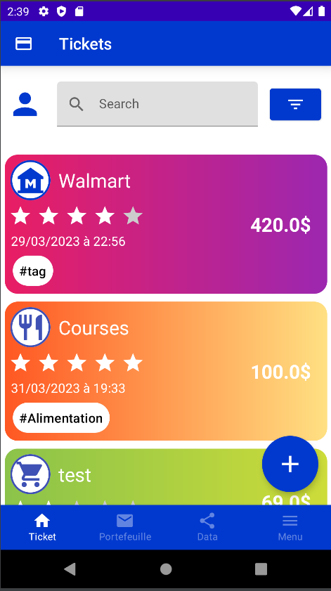
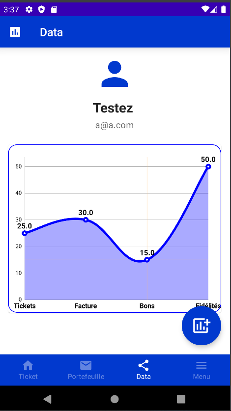
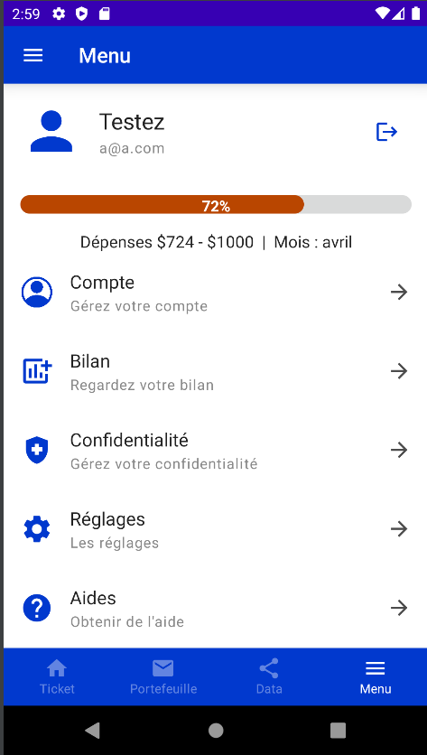

# Digiit
### Digiit is an application that allows the management of purchase documents but also analysis of the latter.

#### This application is written in Kotlin and it's a project for school.

## Digiit have 4 main pages :
### Home

### Wallets

### Data

### Menu

